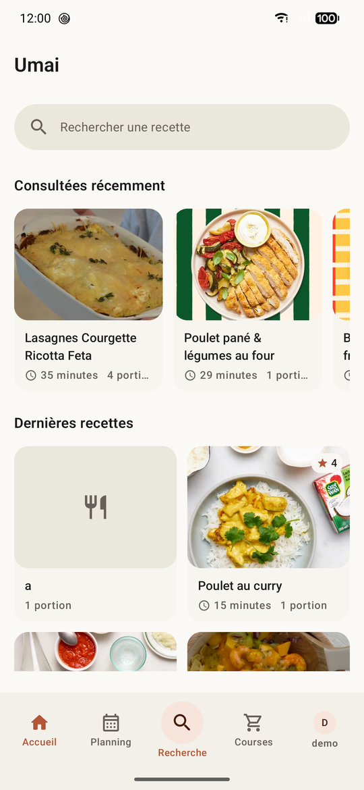
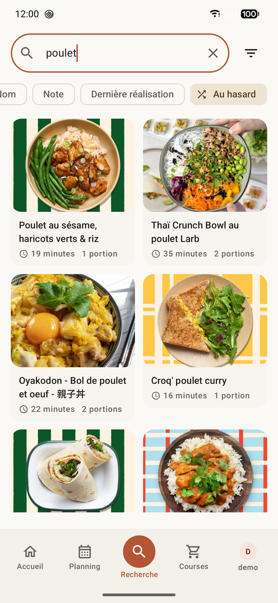
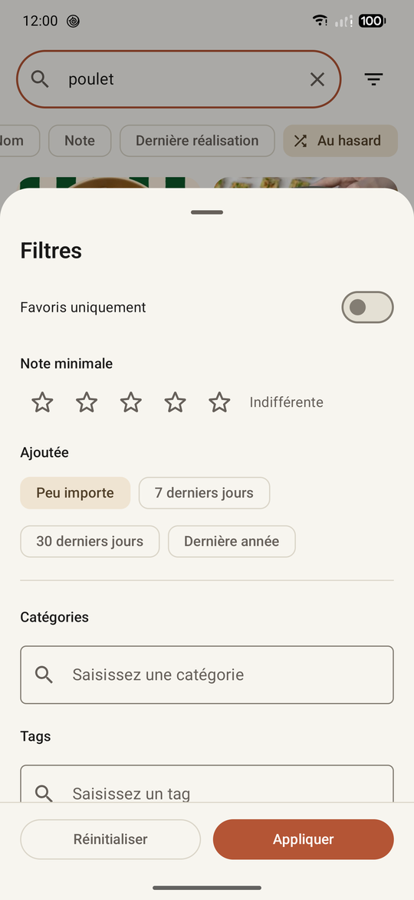
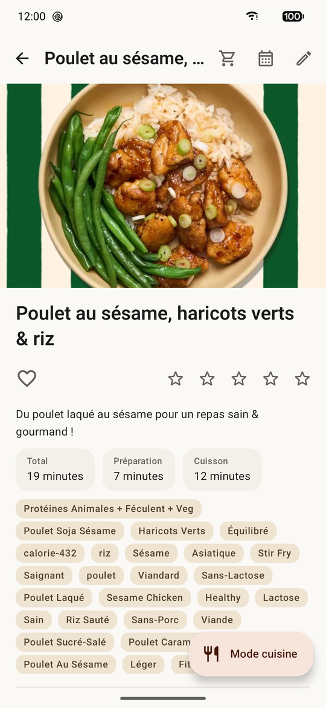
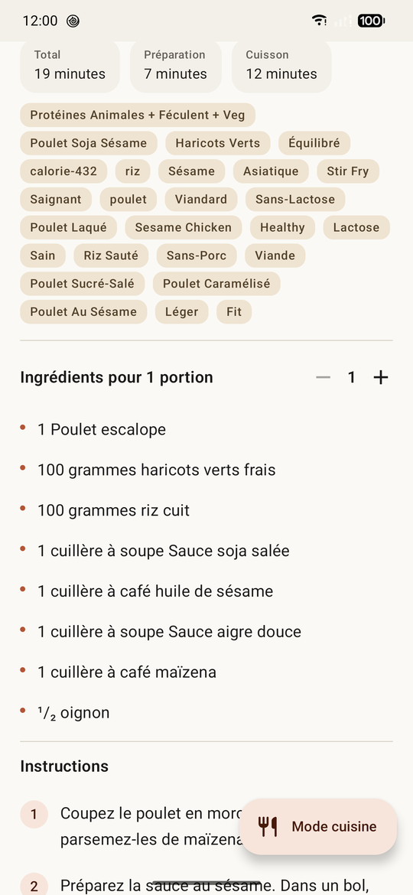
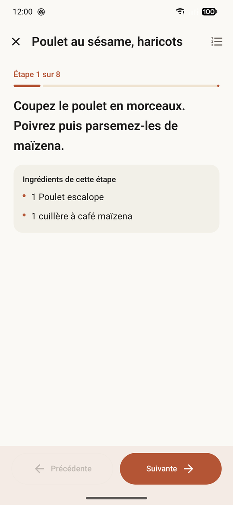
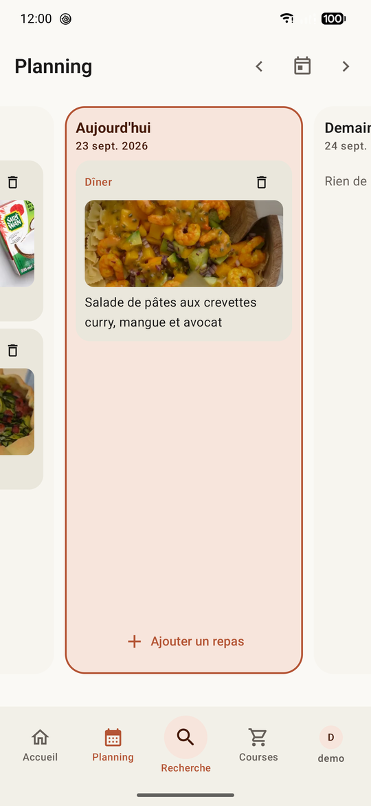
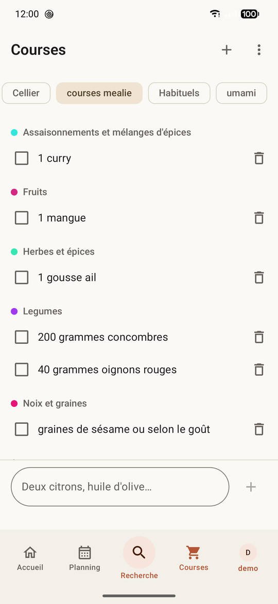
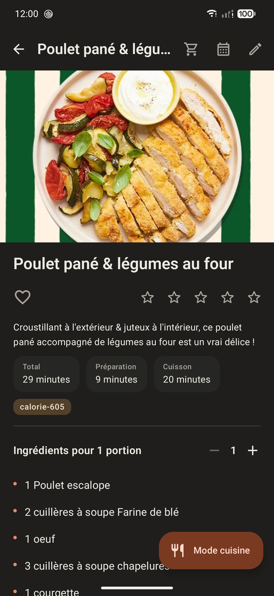

<p align="center">
  <a href="README.md">English</a> ·
  <strong>Français</strong>
</p>

<p align="center">
  
</p>

<h1 align="center">umai</h1>

<p align="center">
  Un client Android natif pour votre instance <a href="https://mealie.io">Mealie</a> auto-hébergée :<br />
  recettes, mode cuisine, planning des repas et listes de courses.
</p>

<p align="center">
  <a href="https://github.com/sargo22341-prog/umai/releases/latest"></a>
  <a href="https://apps.obtainium.imranr.dev/redirect?r=obtainium://add/https://github.com/sargo22341-prog/umai"></a>
</p>

## Avertissement

> [!WARNING]
> Cette application a été **développée avec l'aide d'une intelligence artificielle**.
> Le code, les tests et la documentation ont été produits en grande partie par IA puis vérifiés
> par des tests automatisés, mais tout n'a pas été relu ligne à ligne ni validé dans toutes les
> situations réelles. Utilisez-la en connaissance de cause et consultez les
> [limites connues](#limites-connues).

## Présentation

**umai** met vos recettes Mealie dans votre poche, avec une interface pensée pour la cuisine :
texte lisible de loin et mode cuisine étape par étape, qui peut garder l'écran allumé pendant que
vous cuisinez.

Mealie est le **seul** backend : l'application n'a ni base de données, ni serveur, ni
synchronisation maison. Tout ce que vous faites — noter une recette, planifier un repas, cocher un
article — est écrit directement sur votre instance, et se retrouve aussi dans l'interface web de
Mealie.

Fonctionnalités principales :

- **accueil** : recettes consultées récemment et dernières recettes ajoutées à l'instance ;
- **recherche** par nom, ingrédient ou mot-clé, avec tri (date d'ajout, nom, note, dernière
  réalisation, au hasard ; croissant ou décroissant) et **filtres** : favoris, note minimale, date
  d'ajout, catégories et tags ;
- **fiche recette** : photo, durées, tags (un appui cherche les recettes qui le partagent), favori
  et note sur 5 étoiles, **ajustement des portions** des ingrédients, instructions avec leurs
  photos, commentaires ;
- **mode cuisine** : une étape par écran, les ingrédients de l'étape en cours, la **vidéo de
  l'étape jouée en boucle** quand la recette en a une, **minuteurs** proposés pour les durées
  écrites dans les étapes (plusieurs à la fois, avec son et vibration), écran maintenu allumé
  (facultatif) ;
- **planning** : la semaine du lundi au dimanche, ouverte sur aujourd'hui ; ajout d'une recette
  trouvée avec la recherche complète et ses filtres, ou d'une note ; **planning automatique**
  d'un jour ou de la semaine : un plat à midi et un le soir (jamais de dessert ni de boisson),
  choisis pour partager leurs ingrédients, dans le respect des règles de planning de Mealie ;
- **listes de courses** : plusieurs listes, articles regroupés par étiquette, envoi des ingrédients
  d'une recette vers une liste (ajustés aux portions choisies), et un **mode courses** aux grandes
  lignes cochées d'un seul appui ;
- **création et modification de recettes** : import depuis une page web (analysée par Mealie),
  avec la vidéo et les photos d'étapes de Jow et les photos d'étapes de 750g et Marmiton ;
  **import d'une vidéo YouTube** reconstruite en recette complète (ingrédients, étapes, passage de
  la vidéo de chaque étape) à partir de sa description, de ses chapitres et de sa transcription,
  avec les quantités de la page de recette vers laquelle pointe sa description ;
- **IA locale** facultative : un modèle de langage téléchargé à part tourne sur le téléphone, sans
  service distant, pour l'import vidéo et la reconnaissance des plats
  ([détails et mesures](docs/local-ai.md)) ;
  rédaction étape par étape avec brouillons conservés sur le téléphone, recadrage de la photo ;
- **profil** : compteurs de l'instance, photo de profil avec recadrage ;
- **deux langues** : français et anglais, modifiables dans les réglages ;
- thème clair, sombre ou système, Material 3, couleurs du fond d'écran en option ;
- **aucun compte autre que celui de Mealie, aucun analytics, aucun service Google Play** :
  fonctionne sur GrapheneOS.

### Aperçu

| Accueil | Recherche | Filtres |
| --- | --- | --- |
|  |  |  |

| Recette | Ingrédients | Mode cuisine |
| --- | --- | --- |
|  |  |  |

| Planning | Liste de courses | Thème sombre |
| --- | --- | --- |
|  |  |  |

## Installation

Il n'existe pas de version publiée sur un store : l'APK signé de chaque version est joint aux
releases GitHub du dépôt (il peut être suivi avec Obtainium), ou l'application se compile depuis
les sources.

Prérequis : une instance **Mealie** joignable depuis le téléphone, et un téléphone sous
**Android 17 (API 37)** minimum. Pour compiler : Android Studio récent (JDK 21 embarqué) et SDK
Android 37.

```powershell
$env:JAVA_HOME="C:\Program Files\Android\Android Studio\jbr"
.\gradlew.bat :app:assembleDebug
.\gradlew.bat :app:installDebug
```

Release signée et CI : [Release signée](docs/release.md).

## Connexion à Mealie

1. Au premier lancement, saisir l'adresse de l'instance : un domaine (`mealie.example.com`), une
   adresse IP, un port ou un sous-chemin conviennent. Sans préfixe, HTTPS est utilisé.
2. Se connecter avec **identifiant et mot de passe**, ou coller un **jeton d'API** (Mealie →
   Réglages → Jetons d'API).
3. L'adresse et le mode de connexion se modifient ensuite depuis *Profil → Réglages Mealie*.

Bon à savoir :

- **HTTP** est accepté, mais l'application affiche un avertissement : le mot de passe et les
  recettes circuleraient en clair.
- Une **autorité de certification privée** (mkcert, step-ca…) est prise en charge via les
  certificats CA installés par l'utilisateur dans Android. TLS n'est jamais contourné.
- Pour une instance hébergée **sur le réseau local**, Android 17 exige la permission *accès au
  réseau local* ; l'application ne la demande que si l'adresse pointe vers le réseau local.
- Les favoris exigent un compte utilisateur : avec un simple jeton d'API, l'application le signale
  au lieu d'échouer.

## Confidentialité

- Le jeton d'API est chiffré par le Keystore Android (AES-GCM) avant d'être enregistré ; un **mot
  de passe n'est jamais enregistré**, sous aucune forme.
- Les seules données conservées sur le téléphone sont celles que Mealie ne stocke pas :
  préférences d'affichage, langue, session, liste des recettes consultées récemment et brouillons
  de recettes non terminés.
- L'application ne contacte que votre instance Mealie, et, seulement quand vous vous en servez :
  les sites de recettes connus (Jow, 750g, Marmiton) pour leurs médias, YouTube pour l'import et
  la lecture d'une vidéo (et la page de recette vers laquelle pointe sa description), Hugging Face pour télécharger le modèle de l'IA locale. Le modèle tourne
  sur le téléphone : rien de ce que vous importez ou planifiez ne lui est envoyé ailleurs.

## Limites connues

Elles viennent de l'API Mealie, pas de l'application :

- les durées des recettes sont du texte libre (`"15 minutes"`, `"PT1H"`) : pas de filtre par
  durée ;
- Mealie n'a pas de notion de difficulté ;
- les photos d'étapes n'ont pas de champ dédié : umai affiche les images intégrées au texte de
  l'étape ;
- il n'y a pas d'historique de consultation côté serveur : « consultées récemment » est conservé
  sur le téléphone.

## Stack

| Couche | Technologie |
| --- | --- |
| Langage | Kotlin, coroutines, Flow |
| Interface | Jetpack Compose, Material 3, Navigation Compose |
| Réseau | Retrofit, OkHttp, Kotlin Serialization |
| Images | Coil |
| Vidéo | Media3 ExoPlayer (HLS) |
| IA locale | LiteRT-LM (TPU Tensor → GPU → CPU), modèles `.litertlm` |
| Stockage | DataStore |
| Sécurité | Android Keystore (AES-GCM) |
| Injection | Conteneur écrit à la main |
| Plateforme | Android 17 (API 37) minimum |

## Contribuer

Règles de contribution (humains et agents) : [`AGENTS.md`](AGENTS.md). La référence de l'API
Mealie utilisée par l'application est sa description OpenAPI.

## Licence

Copyright © 2026 sargo.

umai est un logiciel libre distribué sous **licence publique générale GNU, version 3 ou (à votre
choix) toute version ultérieure** (GPL-3.0-or-later) : vous pouvez l'utiliser, l'étudier, le
modifier et le redistribuer, à condition que ce que vous distribuez reste sous la même licence,
avec son code source. Il est fourni sans aucune garantie. Texte complet : [`LICENSE`](LICENSE).

L'application lit YouTube avec [NewPipeExtractor](https://github.com/TeamNewPipe/NewPipeExtractor),
lui-même sous GPL-3.0-or-later ; toutes les autres dépendances sont sous une licence compatible
avec la GPLv3 (Apache 2.0, MIT, BSD, MPL 2.0).

umai est un projet indépendant, sans lien avec Mealie. Les recettes visibles sur les captures
appartiennent à leurs auteurs respectifs.
