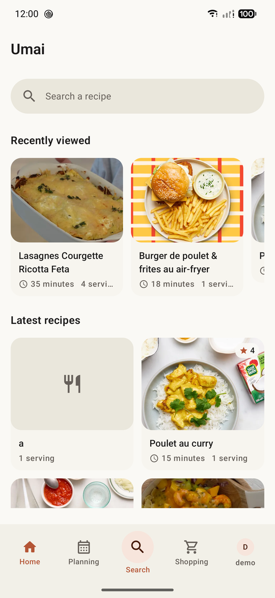
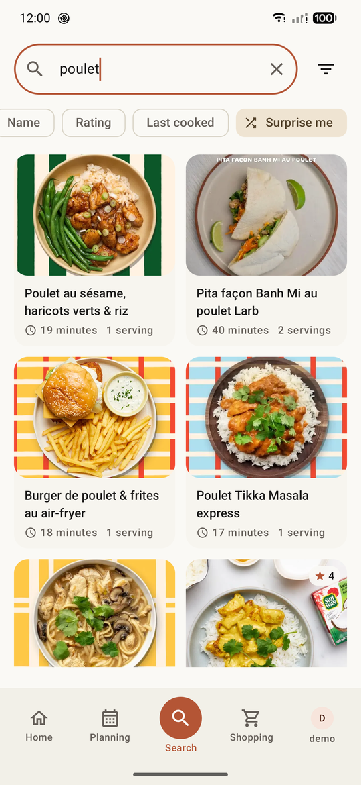
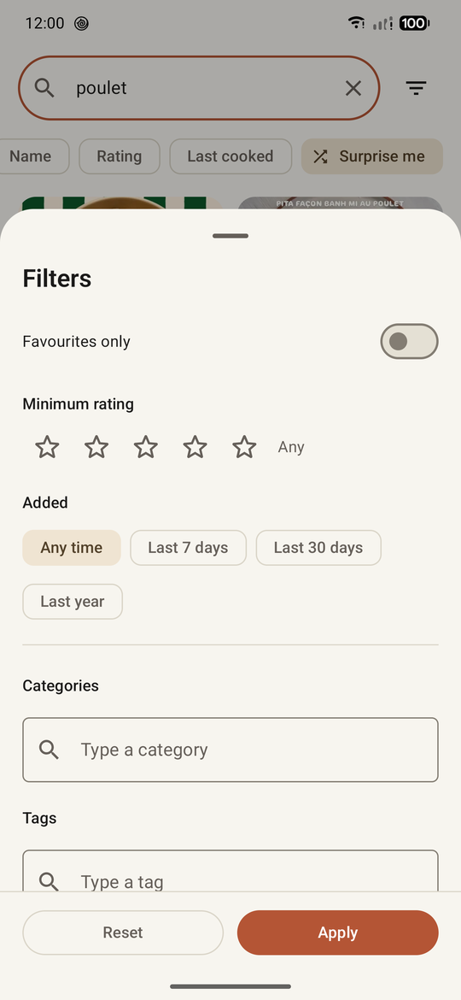
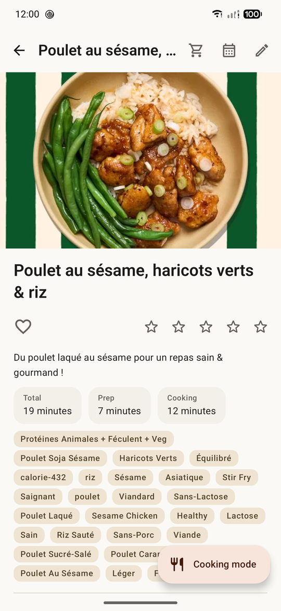
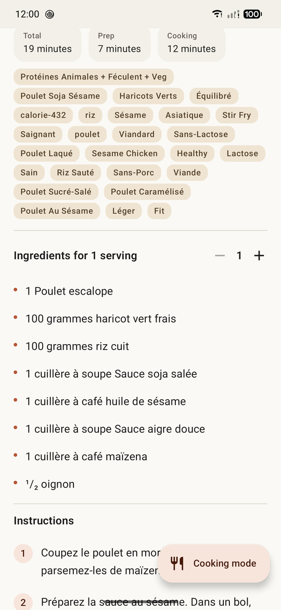
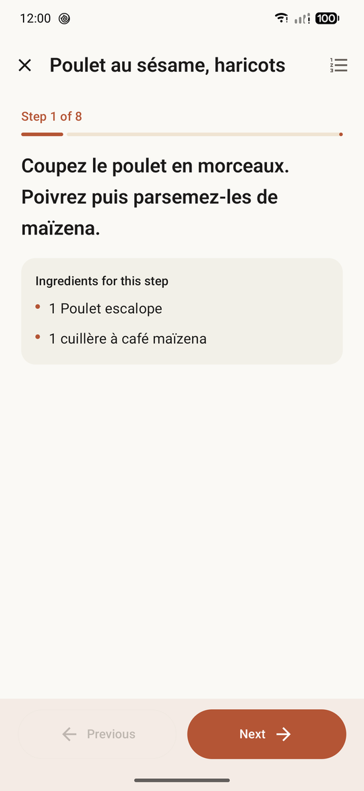
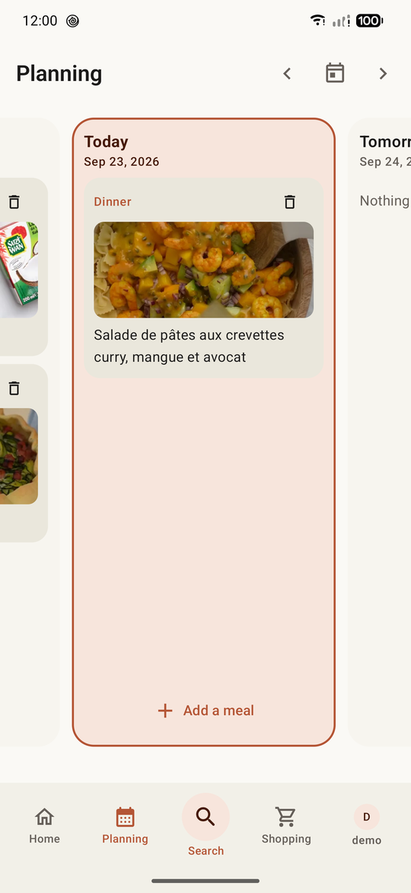
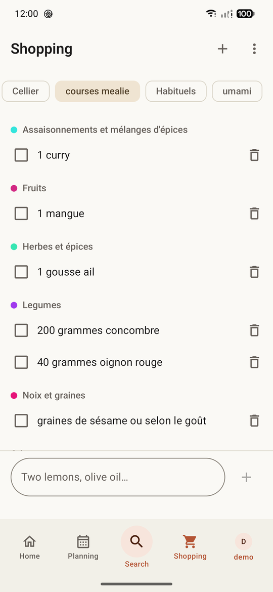
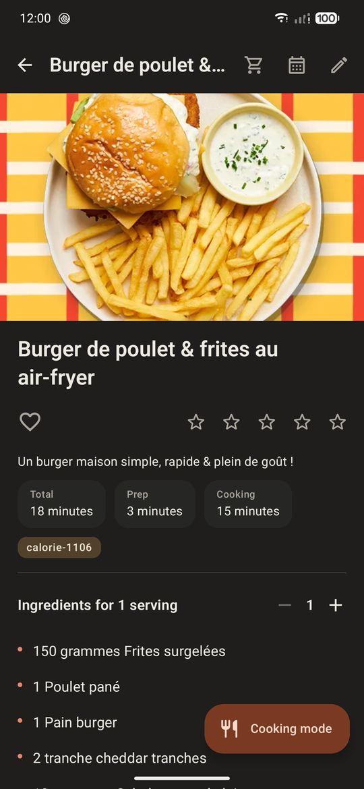

<p align="center">
  <strong>English</strong> ·
  <a href="README.fr.md">Français</a>
</p>

<p align="center">
  
</p>

<h1 align="center">umai</h1>

<p align="center">
  A native Android client for your self-hosted <a href="https://mealie.io">Mealie</a> instance:<br />
  recipes, cooking mode, meal plan and shopping lists.
</p>

<p align="center">
  <a href="https://github.com/sargo22341-prog/umai/releases/latest"></a>
  <a href="https://apps.obtainium.imranr.dev/redirect?r=obtainium://add/https://github.com/sargo22341-prog/umai"></a>
</p>

## Disclaimer

> [!WARNING]
> This application was **developed with the help of artificial intelligence**.
> The code, tests and documentation were largely produced by AI and then checked by automated
> tests, but not everything has been reviewed line by line or validated in every real-world
> situation. Use it knowingly and see the [known limitations](#known-limitations).

## Overview

**umai** puts your Mealie recipes in your pocket, with an interface designed for the kitchen:
large text and a step-by-step cooking mode that can keep the screen on while you cook.

Mealie is the **only** backend: the app has no database, no server and no sync of its own.
Everything you do — rating a recipe, planning a meal, checking off an item — is written straight
to your instance, and shows up in the Mealie web interface too.

Main features:

- **home**: recently viewed recipes and the latest ones added to the instance;
- **search** by name, ingredient or keyword, with sorting (date added, name, rating, last cooked,
  random; ascending or descending) and **filters**: favourites, minimum rating, date added,
  categories and tags;
- **recipe page**: photo, times, tags (a tap searches the recipes that share it), favourite and
  5-star rating, **servings scaling** of the ingredients, instructions with their photos, comments;
- **cooking mode**: one step per screen, the ingredients of the current step, the **video of the
  step played in a loop** when the recipe has one, **timers** offered for the durations written in
  the steps (several at once, with sound and vibration), screen kept on (optional);
- **meal plan**: the week from Monday to Sunday, opened on today; add a recipe found with the full
  search and its filters, or a note; **automatic planning** of a day or of the week: a dish at
  lunch and one at dinner (never a dessert or a drink), chosen to share their ingredients,
  following Mealie's meal plan rules;
- **shopping lists**: several lists, items grouped by label, send the ingredients of a recipe to a
  list (scaled to the chosen servings), and a **shopping mode** with large rows ticked in one tap;
- **recipe creation and editing**: import from a web page (Mealie parses it), with the video and
  step photos of Jow and the step photos of 750g and Marmiton; **import of a YouTube video**
  rebuilt into a full recipe (ingredients, steps, the part of the video of each step) from its
  description, chapters and transcript; write a recipe step by step with drafts kept on the phone,
  crop the recipe photo;
- optional **local AI**: a language model downloaded separately runs on the phone, with no online
  service, for the video import and the recognition of dishes ([details and figures](docs/local-ai.md),
  in French);
- **profile**: counters of your instance, profile picture with cropping;
- **two languages**: English and French, switchable from the settings;
- light, dark or system theme, Material 3, optional wallpaper colours;
- **no account other than your Mealie one, no analytics, no Google Play services**: works on
  GrapheneOS.

### Preview

| Home | Search | Filters |
| --- | --- | --- |
|  |  |  |

| Recipe | Ingredients | Cooking mode |
| --- | --- | --- |
|  |  |  |

| Meal plan | Shopping list | Dark theme |
| --- | --- | --- |
|  |  |  |

## Installation

There is no release on an app store: the signed APK of each version is attached to the
repository's GitHub releases (it can be followed with Obtainium), or the app can be built from
source.

Requirements: a **Mealie** instance reachable from the phone, and a phone running
**Android 17 (API 37)** or later. To build: a recent Android Studio (bundled JDK 21) and Android
SDK 37.

```powershell
$env:JAVA_HOME="C:\Program Files\Android\Android Studio\jbr"
.\gradlew.bat :app:assembleDebug
.\gradlew.bat :app:installDebug
```

Signed release and CI: [Signed release](docs/release.md).

## Connecting to Mealie

1. On first launch, enter the address of your instance: a domain (`mealie.example.com`), an IP
   address, a port or a sub-path all work. Without a prefix, HTTPS is used.
2. Sign in with your **username and password**, or paste an **API token** (Mealie → Settings →
   API tokens).
3. The address and the sign-in method can be changed later from *Profile → Mealie settings*.

Good to know:

- **HTTP** is accepted, but the app shows a warning: your password and recipes would travel
  unencrypted.
- A **private certificate authority** (mkcert, step-ca…) is supported through the CA certificates
  installed by the user in Android. TLS is never bypassed.
- For an instance hosted **on your local network**, Android 17 requires the *local network access*
  permission; the app asks for it only when the address points to a local network.
- Favourites need a user account: with an API token alone, the app says so instead of failing.

## Privacy

- The API token is encrypted with the Android Keystore (AES-GCM) before being stored; a
  **password is never stored**, in any form.
- The only data kept on the phone is what Mealie does not store: display preferences, language,
  the session, the list of recently viewed recipes and unfinished recipe drafts.
- The app only contacts your Mealie instance and, only when you use them: the known recipe
  websites (Jow, 750g, Marmiton) for their media, YouTube to import and play a video, and Hugging
  Face to download the local AI model. The model runs on the phone: nothing you import or plan is
  sent anywhere else.

## Known limitations

They come from the Mealie API, not from the app:

- recipe times are free text (`"15 minutes"`, `"PT1H"`): no filtering by duration;
- Mealie has no notion of difficulty;
- step photos have no dedicated field: umai shows the images embedded in the step text;
- there is no view history on the server: "recently viewed" is kept on the phone.

## Stack

| Layer | Technology |
| --- | --- |
| Language | Kotlin, coroutines, Flow |
| UI | Jetpack Compose, Material 3, Navigation Compose |
| Network | Retrofit, OkHttp, Kotlin Serialization |
| Images | Coil |
| Video | Media3 ExoPlayer (HLS) |
| Local AI | llama.cpp (NDK), GGUF models |
| Storage | DataStore |
| Security | Android Keystore (AES-GCM) |
| Injection | Hand-written container |
| Platform | Android 17 (API 37) minimum |

## Contributing

Contribution rules (humans and agents): [`AGENTS.md`](AGENTS.md). The Mealie API reference used
by the app is its OpenAPI description.

## License

Copyright © 2026 sargo.

umai is open source software distributed under the **MIT License**: you may use, copy, modify
and redistribute it freely, provided the copyright notice and the license text are kept. Full
text: [`LICENSE`](LICENSE).

umai is an independent project, not affiliated with Mealie. The recipes shown in the screenshots
belong to their respective authors.
